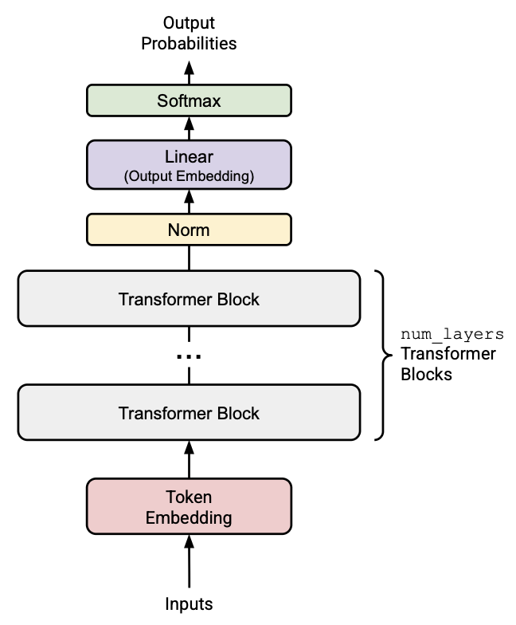
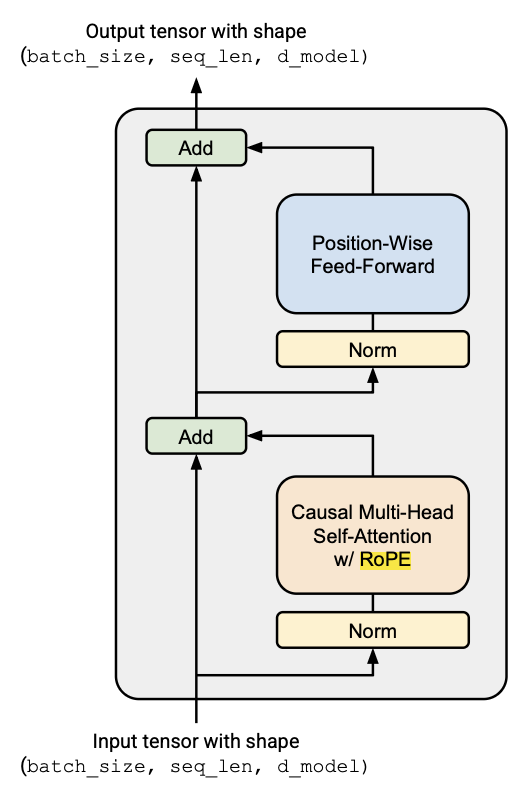
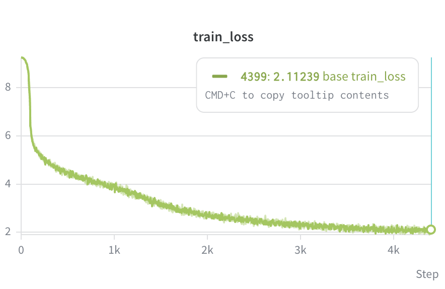
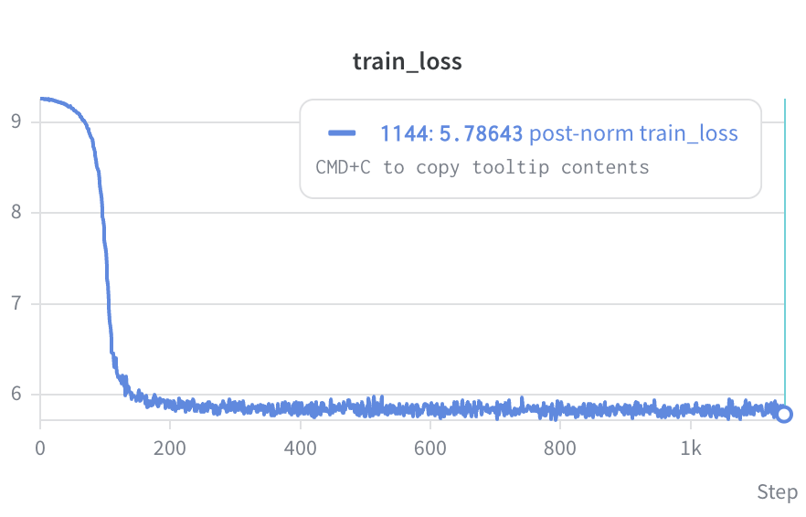
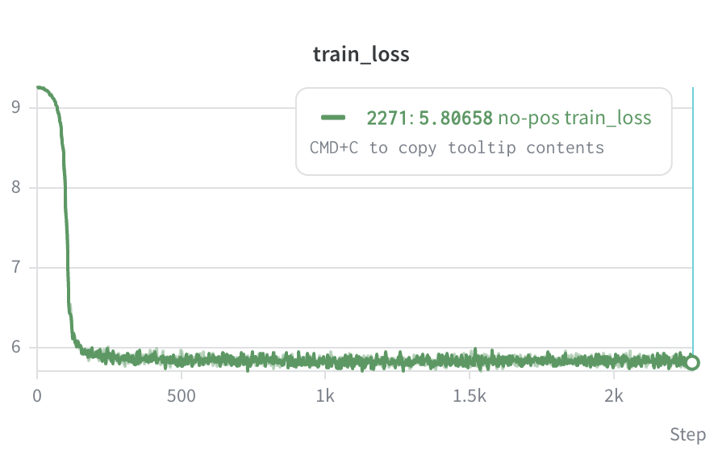
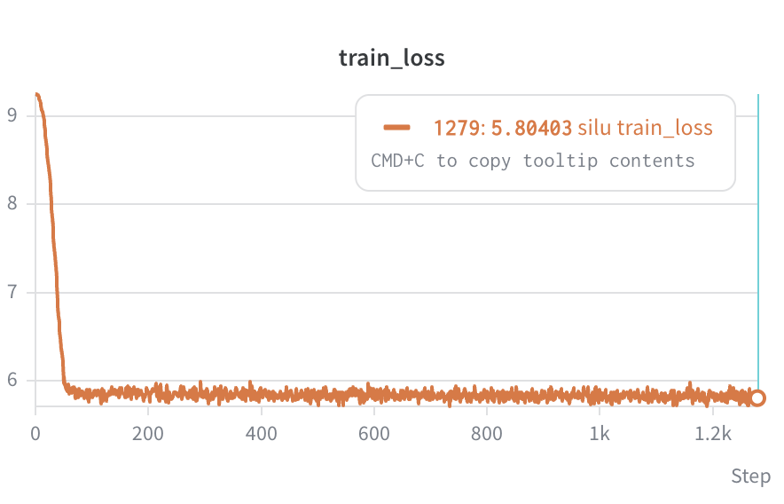

# Story Generator Language Model From-Scratch

A from-scratch transformer language model trained on the TinyStories dataset with approximately 40 million tokens.

For additional information on my process of building the transformer, take a look at [transformer-from-scratch](transformer_from_scratch.pdf).

## Model Architecture

The transformer architecture follows the basic scheme of the achitecture introduced in [Attention is All You Need](https://arxiv.org/pdf/1706.03762), but with three important modern updates that provide better stability during training. These updates are:

- Rotary Position Embeddings (RoPE): An alternative to sinuisoidal position embeddings that allows for the direction representation of relative distances between tokens.

- SwiGLU: A type of feedforward network that combines Swish activation with a Gated Linear Unit (GLU) to allow for both a strong residual connection and nonlinearity. An alternative to the standard MLP positionwise feedforward network

$$ \text{FFN}(x) = \text{SwiGLU}(x, W_1, W_2, W_3) = W_2 (\text{SiLU}(W_1x)) \odot W_3x)$$

- Pre-norm: The original transformer architecture used layer normalization after each self-attention layer, normalizing the input at the two residual connection points in the transformer block after computation. This has been observed to "contaminate" the connection path

The AdamW optimizer is an extension of the Adam optimizer with weight decay for regularization. However, the best training and validation performance occured with weight_decay = 1. A cosine-annealing learning rate schedule was used for more stable training, and gradient clipping was performed before the update step to decrease the effect of abnormally large gradients.

<p align="center">
  
  
</p>

## Hyperparameters

The hyperparameters that resulted in the best training loss (2.11) and best validation loss (2.07) were:

```
batch_size: 32
context_length: 256
d_ff: 1344
d_model: 512
lr: 1e-3
min_lr: 1e-3
num_heads: 16
num_layers: 4
num_steps: 4000
warmup_steps: 100
weight_decay: 1
```

Interestingly, the best training performance occurs without using the weight decay functionality of the AdamW optimizer and without the cosine-annealing learning rate schedule (the minimum and maximum learning are both set at 1e-3).

## Sample Generations

The transformer model was trained on the TinyStories dataset, a synthetically generated collection of short children's stories. From the sampled generations, it is clear that the model doesn't have a good understanding of grammar or punctuation. Additionally, the stories do not have a continuous line of reasoning. Rather than this being an issue with the model architecture, it can almost certainly be attributed to the size of the model. Due to compute constraints, the model was trained on roughly 40M tokens, and increasing the token count would certainly result in higher quality generations.

```
Prompt: "Once upon a time,"

Sample Outputs:
"Once upon a time, but she felt better and liked to go home. He put the boy. She did not come back to play with the fire. Tim and hugged his mom. The big, I will always tried to play with a very good at each other animals. They felt better and it and looked at each other people. Tim and the man said, the chain was not play with her mom and make a happy and then, "Oh no more than a special. One day, I just all day, but she was a big, Tom and started to the red, and put his mom.
One day, Lily and put it and she went home. Tim was very important and said, and then, Tim and put it. He felt better than before, Spot was very smart bear and the broken. They are also liked to find a big, and make noise. The dog was very sad. They became friends.
<|endoftext|>"

"Once upon a time, and wanted to play with her mom. She found a time, Max. She was very happy and said, "I just’s. She takes it was sad and then, "I am a small bird was very fast and wanted to play with a time, and had no more than ever after. She sees a little girl named Lily. She was not play with her room. He says. The other animals.
<|endoftext|>"
```

```
Prompt: "Bobby played with his ball"

Sample Outputs:
"Bobby played with his ball all day, she found a big, and it was on the dog said, "What's red and go to play with a very important.
<|endoftext|>"

"Bobby played with his ball.
The dog named Sam and put the box. They looked like to have a special and see the bottle.
One day, "I feel better than anything. She saw a time, "Don't want to help.
They say they looked at her bed.
<|endoftext|>"

```

## Ablations

The three ablations that were considered are

1. Pre-Norm vs. Post-Norm vs. No-Norm

2. RoPE vs. No Position Embeddings

3. SwiGLU vs. SiLU

From observing the training curves, we see that the base architecture with Pre-Norm, RoPE, and SwiGLU performs significantly better. This comparison also argues for the necessity of each architecture feature to the stability of training. Where the base architecture is capable of reaching a minimum loss near 2.0, each of the other adaptations stalls at approximately 5.8. The No-Norm plot is not given because completely omititng layer normalization from the model results in undefined training and validation losses. This more directly speaks to the importance of normalization as a form of stabilizing training, as in general deep models without normalization are extremely sensitive to vanishing and exploding gradients.

### Base Training Curve with Pre-Norm, RoPE, and SwiGLU

After fine-tuning the model's hyperparameters (especially learning rate), I achieved a best training loss of 2.11 and best validation loss of 2.07.

<p align="center">
  
</p>

### Post-Norm

Rather than performing the RMS layer normalization before the multihead self-attention layer and feedforward network in the transformer block, the normalization is implemented afterwords. We can think of this as normalizing outputs rather than inputs.

<p align="center">
  
</p>

### No Position Embeddings

Some papers have implied that transformer models are capable of learning positional relationships without directly incorporating positional embeddings into the training process. Though, this should be especially difficult on a model of this size.

<p align="center">
  
</p>

### SiLU

A feedforward network implemented with SiLU has the mathematical form $\text{FFN}_{\text{SiLU}}(x) = W_2 (\text{SiLU}(W_1x))$. This differs from the SwiGLU-based FFN in the fact that it contains no GLU. With no direct residual connection, this results in less efficient and stable training.

<p align="center">
     
</p>
